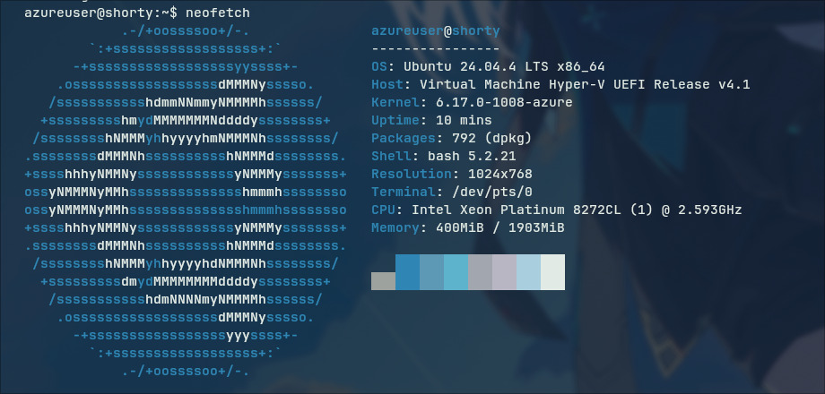

So hi! 
This all started after seeing my nerd friends self-hosting their own servers and me lately learning more about sysadmin stuff while hanging around r/Sysadmin and r/homelab.

But I didn't have either the time or the resources to host my own server on bare metal. Then I realized I still had $100 of free Azure credits remaining, which are going to expire in about 5 months. So I decided why not use them? If not on my own machine, I'll do it on the cloud.

I know many self-hosters will probably call me a *cloud slave* or a *pseudo-hoster*, which is fine by me for now as an amateur. I definitely plan to self-host on bare metal once I get the time and resources and I'll probably write another blog post about that when it happens.

Enough of that, let's start with my journey.  
So first I started looking at which VM configuration I should use for my cloud server, as I have 5 months before my Azure credits expire, I decided to go with a VPS which roughly costs 20 dollars a month so I can afford it for 5 months.
And the best option I found was **Azure Standard B1ms** (1 vCPU, 2 GiB memory) which cost around $17 in the Central India region.

So I went ahead and provisioned a Standard B1ms VM Linux (Ubuntu 24.04) on Azure Central India region, grabbed a public IP from Azure (which is not free btw) and started configuring it.

SSH into the server and update the packages.
And did the first and mandatory thing all Linux cultists do after booting into Linux, that is **neofetch** lol.

Then I installed some basic tools like vim, git, docker and other essential tools I needed.

After that, I started doing some basic amateur sysadmin tasks.

First, I installed Fail2Ban to protect the SSH service from brute-force attacks.   
Fail2Ban monitors login attempts and automatically bans IP addresses that repeatedly fail authentication.
Next, I created a 1GB swap file, because the VPS has limited RAM (2GB).

Since I was using Azure, all ports except SSH (22) were already blocked by default by Azure. Because of that, I didn't need to configure any additional firewall rules on the server itself.

Now was the interesting part, spinning up Docker containers for all my projects and self-hosted services.

First I set up an Nginx Docker container as the reverse proxy because I absolutely love Nginx and hate Caddy, and never tried Traefik before.
Then also set up Certbot to get SSL certificates for my domains.

Opened ports 443 and 80 for HTTP and HTTPS for the Nginx container and made a custom Docker bridge network for Nginx so Nginx can resolve all requests to other Docker containers just by using their container names and not their IP addresses.

After that I ran Docker containers for my personal projects and reverse-proxied them through Nginx.

At this point, my VPS was running several services:
- 1 PostgreSQL container, 1 .NET API container, and 1 Redis container for personal project.
- 2 Reddit bot containers along with 1 Redis container for the subreddits I moderate. These are custom moderation bots that automate certain tasks and collect subreddit metrics for analysis.
- 1 Discord bot for my server which also performs some moderation tasks and collects server metrics for analysis.

After that, I still had quite a lot of RAM left over, so I decided to add more services to the VPS. That's when I started looking for interesting self-hosted services and also asked my friends for recommendations.

I started with one, then found another interesting service, then added another… and before I knew it, I was completely addicted to self-hosting. I started thinking:

*"Wait… I could just host this myself too."*

It is a lot of fun, trust me.

Here are some of the services I self-hosted so far:

- **Beszel** for system and Docker monitoring
- **Forgejo** as a mirror for my GitHub repositories (in case GitHub servers go down, which seems to happen quite often lately)
- **Uptime Kuma** for monitoring my APIs
- **Umami** for website analytics (way better than Google Analytics)
- **Copyparty**, a personal file server
- **Stirling PDF** for working with documents
- A few custom APIs and scripts that I use for side projects

What still surprises me is that all of this is running on **1 vCPU and 2GB of RAM**. I honestly never thought it could handle this much load.  
Swap magic is real, I guess.

Of course, I’m still very much learning the sysadmin side of things figuring out proper backups, load balancing,etc.

My Azure credits won't last forever. Maybe after 5 months I will buy raspberry pi or mini pc and finally make the jump to a dedicated machine under my own desk (the true r/homelab dream).

Until then, I’ll probably keep adding more containers until the server blows up.

**If you’re sitting on some cloud credits or have an old laptop lying around, take this as your sign: Go host something.**
