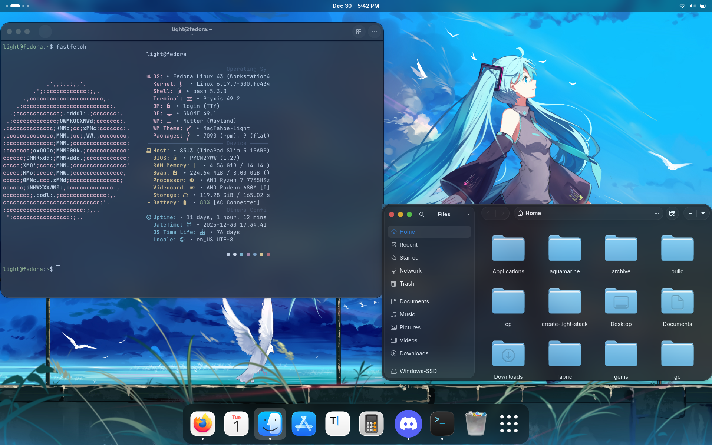
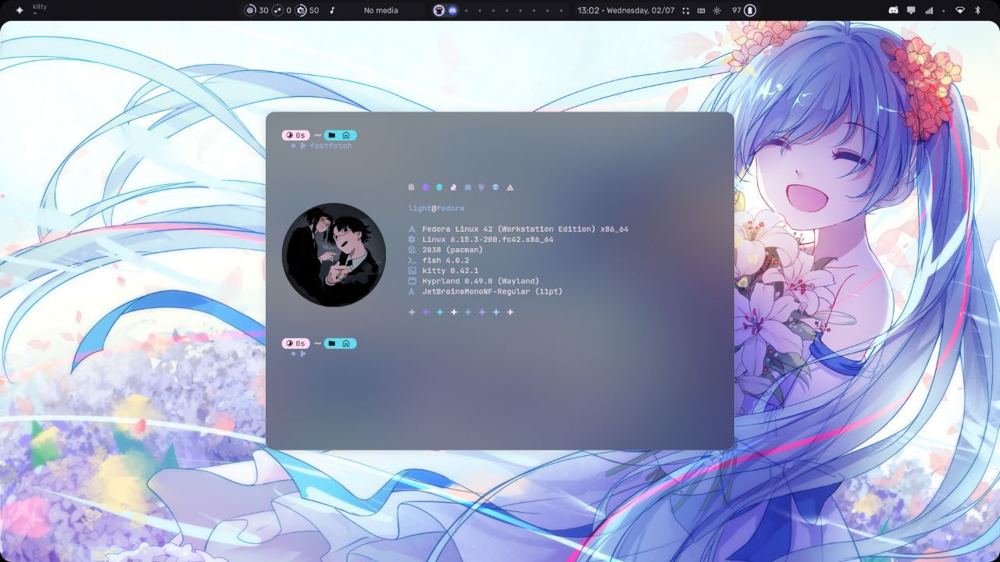
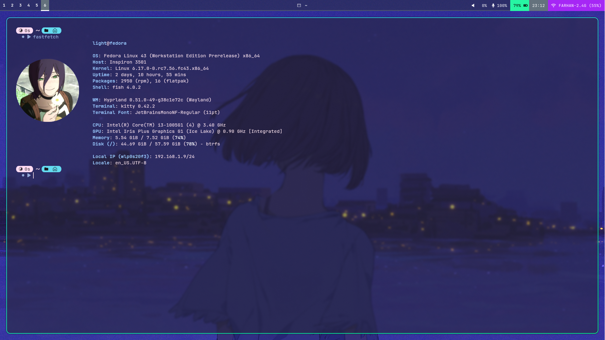
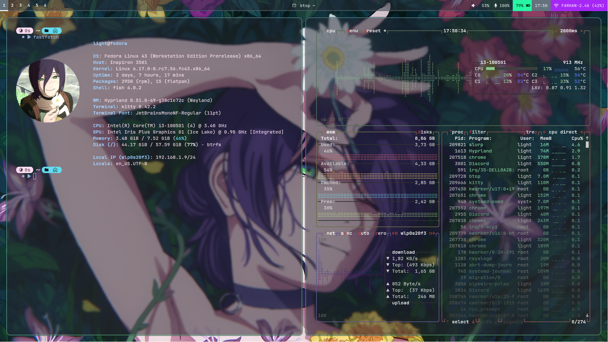
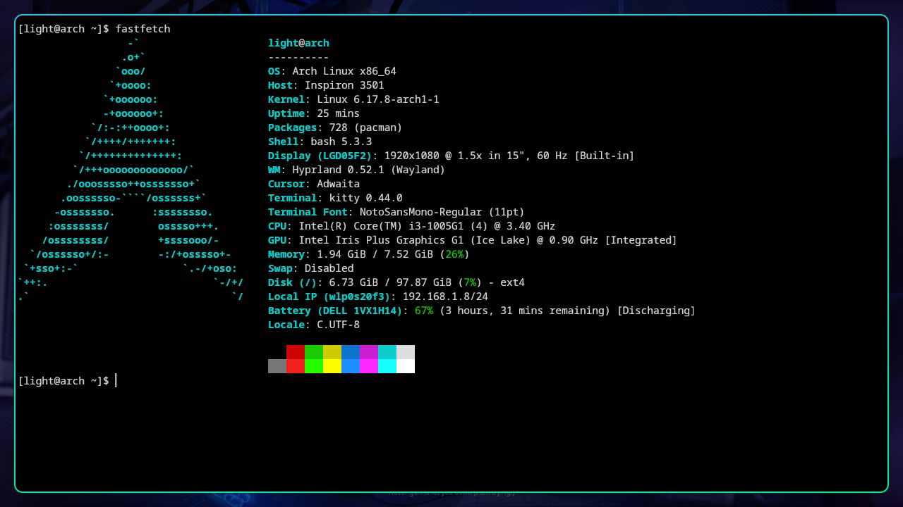

So hi! I have been using Linux for more than a year now, and I have learned a lot. I just wanted to share my experience with everyone.

## The Rough Start: Virtualization & Kali

It all started because my old laptop was struggling to keep up with Windows. I was too nervous to dual-boot at first because my sisters and I shared the laptop, and "nuking" the drive by accident was not an option.

I began by running Kali Linux inside VMware. Looking back, this was a mistake. Kali is not built for daily driving, and running it virtually on a low-end system meant it was competing with Windows for resources. It was slow and clunky, but it served its purpose: it forced me to get comfortable with the CLI and basic Linux commands.

## Finding Home in Fedora

After two months, I finally gained the courage to dual-boot. I chose Fedora because I wanted something stable, beginner-friendly, and up to date without the "bleeding edge" risks of a rolling release.

The experience was amazing. I started with [GNOME](https://www.gnome.org/) as Desktop Enivorment and loved how fast and smooth it was.

## Jump to Hyprland

Things started to change when I came to know about ricing and Tiling WM. I soon switched to Hyprland, a modern tiling window manager and initially used the [end-4](https://github.com/end-4/dots-hyprland) dotfiles.

Using a tiling window manager at first was a bit difficult. But soon, I started relying more on my keyboard than my mouse, switching from editors like VS Code to (Neo)Vim and relying heavily on keyboard shortcuts. Eventually, I felt limited by pre-made configs and decided to write my own dotfiles from scratch.

## I Use Arch, By the Way

After ten months of Fedora being my daily driver, a college friend told me to try Arch. I had always been intimidated by the "Arch is hard" stereotype, but after living in the terminal for months, I felt ready. I started reading the Arch Wiki and soon installed it on bare metal (after a bit of bullying, *ahem*), triple booting Windows, Fedora, and Arch.

## Where I Am Now

Today, my workflow is almost entirely keyboard-driven. Whether I'm working on C/C++ projects or web dev, everything happens inside a terminal and NeoVim. There’s something incredibly satisfying about a setup that stays out of your way and lets you focus on the code.

I’m still refining my Arch/Fedora setup and constantly tweaking my Hyprland configs. If you're curious about my setup, you can check out my [dotfiles here](https://github.com/Farhan291/dotfiles).

It’s been a wild year of distro-hopping and troubleshooting, but I wouldn't go back to Windows for anything other than the occasional game.
