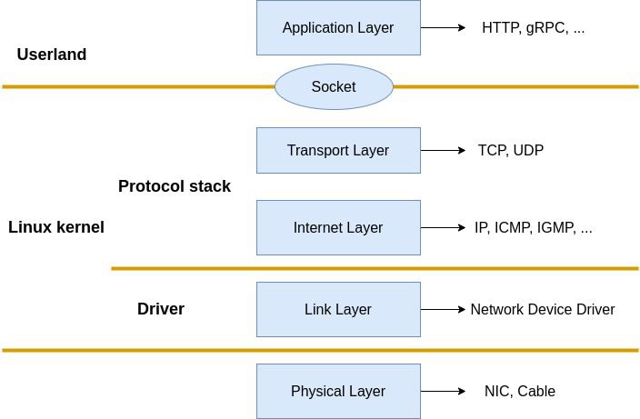

## Introduction 
Lately, I’ve been moving away from high-level abstractions and diving into how things actually travel across the wire. We often talk about "packets" as these abstract units of data, but at the end of the day, they are just contiguous chunks of memory with a very specific layout.

To understand this, I’ve been working on a project called [**NetScribe**](https://github.com/Farhan291/NetScribe). It's a packet sniffer written in C that uses raw sockets to capture frames and manually parse them. No high-level libraries - just coffee and segfaults pains.

## Raw socket
A raw socket is a socket with no protocol abstraction applied. Raw socket allows us to bypass the kernel's network stack processing. Instead of the OS stripping headers for us, we get the full, unadulterated buffer off the wire.  
On Linux systems, a raw socket can be created using the POSIX socket() API:
```c
#include <sys/socket.h>
 int raw_sock = socket(
        AF_PACKET,
        SOCK_RAW,
        htons(ETH_P_ALL)
    );
```
Here is what is happening:
-  **AF_PACKET**: This tells the kernel we want to operate at the Data Link Layer (Layer 2). Unlike AF_INET (which gives you IP packets), this gives us the Ethernet frames directly from the device driver.

- **SOCK_RAW**: Indicates that the socket should expose the entire frame, including Ethernet headers.
Nothing is stripped or interpreted by the kernel.

- **htons(ETH_P_ALL)**: This macro ensures we capture all protocols (IPv4, IPv6, ARP, etc.), not just a specific type.

If this call succeeds, raw_sock becomes a socket descriptor connected directly to the network interface.

>  **Security Note:** Raw sockets require elevated privileges. On Linux, you'll need to run this program with `sudo` or grant it the `CAP_NET_RAW` capability. This is because raw sockets can capture all network traffic and potentially be used maliciously.

## Receiving Bytes from the Kernel

Now that our raw socket is ready, the next step is to receive raw packet data from the kernel. At this level, the kernel does not interpret or modify the packet in, it simply copies the bytes exactly as they appear on the wire into user space.
```c
 ssize_t rc = recvfrom(raw_sock, buffer, sizeof(buffer), 0, NULL, NULL);
```
The **recvfrom()** function (provided by sys/socket.h) blocks the program until a packet arrives. When one does, the kernel copies the entire frame - Ethernet headers, IP headers, and payload into our buffer.  
The return value data_size is crucial: it tells us exactly how many bytes were captured. If it returns -1, the read failed.
Since we already know packets are coming from the link layer, we don’t need source address information here thats why we put 0 (no special flag), NULL,NULL.

## Note on Byte Order

Throughout this code, you'll see functions like `ntohs()` (network to host short) and `htons()` (host to network short). This is because network protocols use **big-endian** byte order (most significant byte first), while many CPUs (like x86) use **little-endian** (least significant byte first).

For example, the port number 443 in memory:
- **Network (big-endian):** `0x01 0xBB` → reads as 443
- **Host (little-endian on x86):** `0xBB 0x01` → reads as 443

The `ntohs()` function converts a 16-bit value from network byte order to host byte order so we can work with it correctly. Without this conversion, port 443 might appear as 47873 on system.



## Layer 2: The Ethernet Frame

Every packet starts here. The Ethernet header is exactly 14 bytes: 6 bytes for the Destination MAC, 6 bytes for the Source MAC, and 2 bytes for the EtherType.
```c
typedef struct {
  unsigned char dest_mac[6];
  unsigned char src_mac[6];
  unsigned short eth_type;

} ether;

char *etherparse(char *buff, ether *ethernetheader) {
  char *ptr = buff;
  
  memcpy(ethernetheader->dest_mac, ptr, 6);
  ptr += 6;
  
  memcpy(ethernetheader->src_mac, ptr, 6);
  ptr += 6;
  
  memcpy(&ethernetheader->eth_type, ptr, 2);
  ptr += 2;
  
  return ptr; // Returns pointer to the start of Layer 3
}

```
We simply copy the MAC addresses and the Ethernet type into our struct using memcpy, advancing our pointer (ptr) as we go. And just like that, we have parsed layer 2 the Ethernet header is done.

## Layer 3: Network 
Based on ethernet type the network layer can varies it support many protocols but we will focus on main three **arp,ip4 and ip6**. so we first check the ethernet type

```c
int check_ipver(ether *eth) {
  if (ntohs(eth->eth_type) == 0x0800) {
    return IP4;
  } else if (ntohs(eth->eth_type) == 0x86DD) {
    return IP6;
  } else if (ntohs(eth->eth_type) == 0x0806) {
    return ARP;
  }
  return 0;
}
`

```
### ARP
When a host wants to send an IP packet to another device on the same network, it must first know the destination MAC address. ARP provides this mapping by broadcasting a request and receiving a reply containing the target’s MAC address.
```c
typedef struct {
  uint16_t htype;        /* Format of hardware address */
  uint16_t ptype;        /* Format of protocol address */
  uint8_t hlen;          /* Length of hardware address */
  uint8_t plen;          /* Length of protocol address */
  uint16_t op;           /* ARP opcode (command) */
  uint8_t sha[ETH_ALEN]; /* Sender hardware address */
  uint32_t spa;          /* Sender IP address */
  uint8_t tha[ETH_ALEN]; /* Target hardware address */
  uint32_t tpa;          /* Target IP address */
} arp_hdr;
```

### IP4
IPv4 is the Internet Protocol used at the network layer. Its header carries routing information and has a minimum size of 20 bytes, with optional fields extending it when needed.
```c
typedef struct {
  unsigned char ver_ihl;
  unsigned char service;
  unsigned short length;
  unsigned short ident;
  unsigned short frag;
  unsigned char ttl;
  unsigned char protocol;
  unsigned short check;
  unsigned char src[4]; //src_ip
  unsigned char dst[4]; //dest_ip

} ip4_hdr;
```
- **ver_ihl** -  
Upper 4 bits → IP version (always 4)  
Lower 4 bits → Header length in 32-bit words 
- **service** -
Type of Service (DSCP/ECN), used for priority and congestion control
- **length** -
Total length of the IP packet (header + payload) in bytes

- **ident** -
Identification value used for IP fragmentation and reassembly

- **frag** -
Fragmentation flags and fragment offset

- **ttl** -
Time To Live — decremented at each hop to prevent infinite loops

- **protocol** -
Indicates the next layer protocol (TCP = 6, UDP = 17, ICMP = 1)

- **check** -
Header checksum (covers only the IP header)

Parsing
```c 
  char *ip4_parse(char *buff, ip4_hdr *ip, char *ptr) {
  memcpy(&ip->ver_ihl, ptr, 1); ++ptr;
  memcpy(&ip->service, ptr, 1); ++ptr;
  memcpy(&ip->length, ptr, 2);  ptr += 2;
  // ... copy remaining fields ...
  memcpy(ip->src, ptr, 4);      ptr += 4;
  memcpy(ip->dst, ptr, 4);      ptr += 4;
  return ptr;
}
```
And here is how we use that length to calculate exactly where the payload begins:
```c
case IP_V4: {
      ptr = ip4_parse(buffer, &ip4, ptr);
      
      // Total length of the packet (Header + Payload)
      int ip_total_len = ntohs(ip4.length);
      
      // Extract IHL and convert to bytes (words * 4)
      int ip_hdr_len = (ip4.ver_ihl & 0x0F) * 4;
      
      // Calculate how much data is left for TCP/UDP
      tcp_payload_len = ip_total_len - ip_hdr_len;
      
      check_protocol = transport_layer_checker4(&ip4);
      break;
}
```
### IP6
Unlike IPv4, the IPv6 base header has a fixed size of 40 bytes, but the total packet size can vary due to extension headers and payload length.
```c
typedef struct {
  union {
    uint32_t header; // 1st 4 bytes (Ver, Traffic Class, Flow Label)
    struct {
      uint32_t version : 4;
      uint32_t traffic_class : 8;
      uint32_t flow_label : 20;
    };
  };
  union {
    uint32_t head; // 2nd 4 bytes (Payload Len, Next Header, Hop Limit)
    struct {
      uint32_t payload_len : 16;
      uint32_t next_header : 8;
      uint32_t hop_limit : 8;
    };
  };
  __uint128_t src;
  __uint128_t des;

} ip6_hdr;
```
- **version** -
IP version (always 6)

- **traffic_class** -
Packet priority and congestion control information

- **flow_label** -
Used to identify packets belonging to the same flow

- **payload_len** -
Length of the payload (excluding the 40-byte IPv6 header)

- **next_header** -
Indicates the next protocol or extension header (TCP, UDP, ICMPv6, etc.)

- **hop_limit** -
Maximum number of hops before the packet is discarded

## Layer 4: Transport 
Based on next_header or protocol in ip6 or ip4 the transport protocol is decided. Again there are many transport protocol but we will focus on tcp, udp only.
### UDP
UDP is the simplest of the bunch. It is connectionless, unreliable, and has a fixed 8-byte header. This makes parsing it trivial compared to TCP.
```c
typedef struct {
  unsigned short src;
  unsigned short des;
  unsigned short lenght;
  unsigned short checksum;
} udp;

char *udp_parse(udp *udp, char *ptr) {
  memcpy(&udp->src, ptr, 2);
  ptr += 2;
  memcpy(&udp->des, ptr, 2);
  ptr += 2;
  memcpy(&udp->lenght, ptr, 2);
  ptr += 2;
  memcpy(&udp->checksum, ptr, 2);
  ptr += 2;
  return ptr;
}
```
Because the header size is fixed, we don't need any complex offset calculations. We just copy the 8 bytes, and whatever is left is the payload

### TCP
TCP is where things get interesting (and slightly painful). Unlike UDP, the TCP header is variable in length. It can have options appended to it, which means we can't just assume a fixed size and move on.  
We have to read the Data Offset (doff) field to figure out where the header actually ends.
```c
typedef struct {
  unsigned short src;
  unsigned short des;
  uint32_t seqno;
  uint32_t ackno;
  union {
    unsigned short flag;
    struct {
      uint16_t res1 : 4;
      uint16_t doff : 4;
      uint16_t fin : 1;
      uint16_t syn : 1;
      uint16_t rst : 1;
      uint16_t psh : 1;
      uint16_t ack : 1;
      uint16_t urg : 1;
      uint16_t ece : 1;
      uint16_t cwr : 1;
    };
  };
  unsigned short winsize;
  unsigned short check;
  unsigned short urgptr;
} tcp;
```

- **seqno** - the sequence number is a 32 bit field that indicates how much data is sent during the TCP session. When you establish a new TCP connection (3 way handshake) then the initial sequence number is a random 32 bit value. The receiver will use this sequence number and sends back an acknowledgment.  
- **ackno** - this 32 bit field is used by the receiver to request the next TCP segment. This value will be the sequence number incremented by 1.
- **res1** - Reserved bits
- **doff** - Data offset size of TCP header in 32-bit words
- **fin** - Finish flag, used to close a connection
- **syn** - Synchronize flag, used to start a connection
- **rst** - Reset flag, aborts a connection
- **psh** - Push flag, deliver data immediately to application
- **ack** - Acknowledgment flag, indicates ackno is valid
- **urg** - Urgent flag, urgent pointer field is valid
- **ece** - ECN Echo, used for congestion notification
- **cwr** - Congestion Window Reduced, congestion control signal
- **winsize** - specifies how many bytes the receiver is willing to receive
- **check** - TCP checksum 
- **urgptr** - Urgent pointer 

The parsing function requires some math. The doff field tells us the number of 32-bit words in the header. To get bytes, we multiply by 4.
```c
char *tcp_parser(tcp *tcph, char *ptr) {
  char *temp = ptr; // Keep track of where the header started
  memcpy(&tcph->src, ptr, 2); ptr += 2;
  memcpy(&tcph->des, ptr, 2); ptr += 2;
  memcpy(&tcph->seqno, ptr, 4); ptr += 4;
  memcpy(&tcph->ackno, ptr, 4); ptr += 4;
  memcpy(&tcph->flag, ptr, 2); ptr += 2;
  memcpy(&tcph->winsize, ptr, 2); ptr += 2;
  memcpy(&tcph->check, ptr, 2); ptr += 2;
  memcpy(&tcph->urgptr, ptr, 2); ptr += 2;
  uint16_t flags_word = ntohs(tcph->flag);
  unsigned int data_offset_in_words = (flags_word >> 12);
  unsigned int header_len = data_offset_in_words * 4;
  if (header_len < 20) {
    fprintf(stderr, "Invalid TCP header len: %u\n", header_len);
    return NULL; 
  }
  // Jump exactly to where the payload begins
  ptr = temp + header_len;
  return ptr;
}
```
### ICMP
First of all, ICMP is not a transport protocol. So why did I put it in the "Transport Layer" section?  
I did it to simplify the mental model. In our code, we parse ICMP after the IP header—exactly where we parse TCP and UDP. So for the sake of this tutorial, it lives here. If you want to dive into the debate about whether it belongs to Layer 3 or Layer 4, check out [this StackOverflow answer](https://stackoverflow.com/questions/19218596/is-icmp-a-transport-layer-protocol).  
The header is very compact: 4 bytes containing the Type, Code, and Checksum, followed by a 4-byte body (which often contains an ID and Sequence number for pings).
```c
typedef struct {
  union {
    uint32_t header;
    struct {
      uint32_t type : 8;
      uint32_t code : 8;
      uint32_t check : 16;
    };
  };
  unsigned char message[4];

} icmp_hdr;
char *icmp_parse(icmp_hdr *icmp, char *ptr) {
  memcpy(&icmp->header, ptr, 4);
  ptr += 4;
  memcpy(icmp->message, ptr, 4);
  ptr += 4;
  return ptr;
}
```
## Layer 5/6: The Session Layer (TLS)
Finally, we reach the encryption layer. You might ask, "Wait, isn't TLS traffic encrypted? How can we sniff it?"  
You are right, the application data is encrypted. However, the TLS Handshake the negotiation where the client and server agree on keys—starts in plain text. By parsing these initial packets, we can see exactly how the secure tunnel is being built.  
Technically, TLS sits between the Transport Layer (TCP) and the Application Layer (HTTP). In the OSI model, this covers the Session (Layer 5) and Presentation (Layer 6) layers.
### Record Header
Every TLS packet is wrapped in a Record Header. This header tells us what kind of content is inside (e.g., Alert, Handshake, or Application Data).
```c
typedef struct {
  uint8_t content_type;
  uint16_t version;
  uint16_t len;
} tls_record_header;

char *tls_record_hdr_parse(tls_record_header *tls, char *ptr) {
  memcpy(&tls->content_type, ptr, 1);
  ptr++;
  memcpy(&tls->version, ptr, 2);
  ptr += 2;
  memcpy(&tls->len, ptr, 2);
  ptr += 2;
  return ptr;
}
```
###  Handshake Protocol
If the Record Header says the content type is 22 (Handshake), we can parse further to see what step of the handshake is happening. This is where we catch the Client Hello and the Server Hello.

```c 
typedef enum {
  HELLO_REQUEST = 0,
  CLIENT_HELLO = 1,
  SERVER_HELLO = 2,
  CERTIFICATE = 11,
  SERVER_KEY_EXCHANGE = 12,
  FINISHED = 20
} HandshakeType;

typedef struct {
  uint8_t msg_type;
  uint8_t length[3]; // 24-bit integer
} tls_handshake;

char *tls_record_frag_parse(tls_handshake *tls, char *ptr) {
  memcpy(&tls->msg_type, ptr, 1);
  ptr++;
  memcpy(&tls->length, ptr, 3);
  ptr += 3;
  return ptr;
}

void print_tls_record_frag(tls_handshake *tls) {
  printf("HDSH    | Type:%d", tls->msg_type);
  switch (tls->msg_type) {
    case CLIENT_HELLO: printf("(Client Hello)"); break;
    case SERVER_HELLO: printf("(Server Hello)"); break;
    case FINISHED:     printf("(Finished)"); break;
    default:           printf("(Unknown)"); break;
  }
  // Convert the weird 3-byte length field to a standard int
  uint32_t len = (tls->length[0] << 16) | (tls->length[1] << 8) | tls->length[2];
  printf(" len:%u\n", len);
}
```
## Finale
We have successfully sniffed and parsed every major layer of the network stack, from raw Ethernet frames all the way up to TLS handshake messages.  
While we could parse the application layer (like HTTP), most traffic today is encrypted (HTTPS/TLS), so without the session keys, it would just look like random noise.
Since my goal was to understand the headers and not to write a spy tool, I stopped here.

Here is some output from my packet sniffer. 
```c
// TCP
MAC     | xx:xx:xx:xx:xx:xx --> xx:xx:xx:xx:xx:xx PROTO: 0x0800
IP4     | 151.101.65.91 --> 192.168.1.11 VERSION:4 IHL:5 PROTO:6 TOS:0 TTL:54 ID:24110 CHECK:4682 LEN:1492
TCP     |:443-->:33890 SEQNO:320505567 ACKNO:862279967 doff:8 ACK(0x0010) WINSIZE:425 CHECK:36277 URGPTR:0 
TLS_RCD | type:22 ver:771 len:1210 
HDSH    |  Type:2(Server Hello)len:1206
```
```c 
// UDP
MAC     | xx:xx:xx:xx:xx:xx --> xx:xx:xx:xx:xx:xx PROTO: 0x0800
IP4     | 142.251.220.106 --> 192.168.1.11 VERSION:4 IHL:5 PROTO:17 TOS:0 TTL:58 ID:0 CHECK:133e LEN:150
UDP     |443-->40849 LEN:130 CHECK:47836
```
```c 
// ICMP
MAC     | xx:xx:xx:xx:xx:xx --> xx:xx:xx:xx:xx:xx PROTO: 0x0800
IP4     | 192.168.1.11 --> 8.8.8.8 VERSION:4 IHL:5 PROTO:1 TOS:0 TTL:64 ID:62737 CHECK:73d4 LEN:84
ICMP    | type:98 code:176 check:2048 body: 00 01 00 01
```
```c 
// ARP
MAC  | xx:xx:xx:xx:xx:xx --> FF:FF:FF:FF:FF:FF PROTO: 0x0806
ARP  | op: 1
     Sender MAC: xx:xx:xx:xx:xx:xx
     Sender IP: 192.168.1.1
     Target MAC: 00:00:00:00:00:00
     Target IP: 192.168.1.2

MAC  | xx:xx:xx:xx:xx:xx --> xx:xx:xx:xx:xx:xx PROTO: 0x0806
ARP  | op: 2
     Sender MAC: xx:xx:xx:xx:xx:xx
     Sender IP: 192.168.1.11
     Target MAC: xx:xx:xx:xx:xx:xx
     Target IP: 192.168.1.1
```
